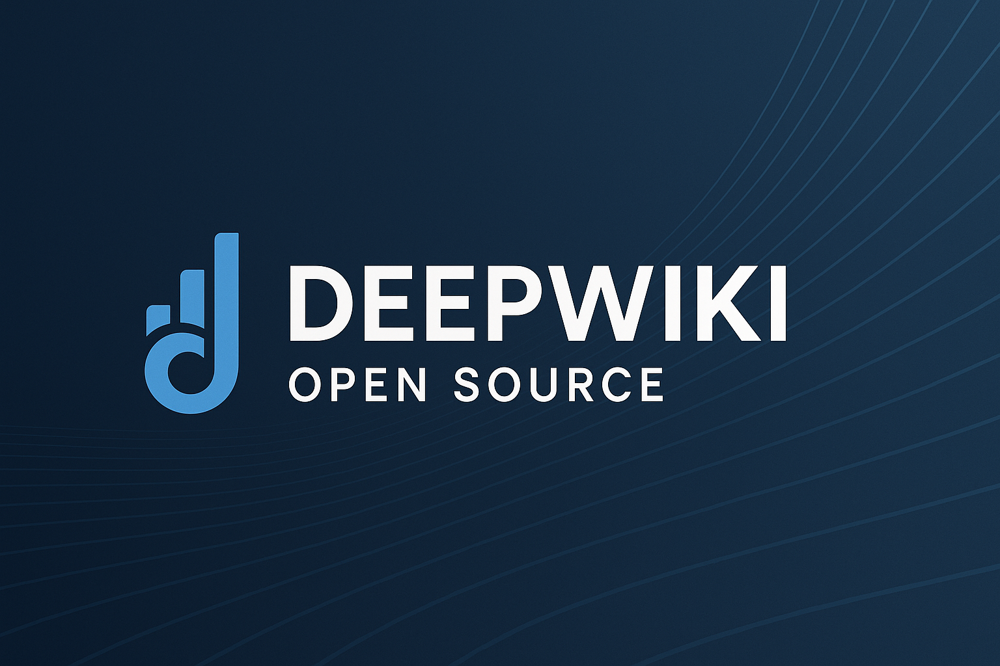

# DeepWiki-Open



**DeepWiki** is my own implementation attempt of DeepWiki, automatically creates beautiful, interactive wikis for any GitHub repository! Just enter a repo name, and DeepWiki will:

1. Analyze the code structure
2. Generate comprehensive documentation
3. Create visual diagrams to explain how everything works
4. Organize it all into an easy-to-navigate wiki

## ✨ Features

- **Instant Documentation**: Turn any GitHub repo into a wiki in seconds
- **Smart Analysis**: AI-powered understanding of code structure and relationships
- **Beautiful Diagrams**: Automatic Mermaid diagrams to visualize architecture and data flow
- **Easy Navigation**: Simple, intuitive interface to explore the wiki

## 🚀 Quick Start (Super Easy!)

### Step 1: Set Up Your API Keys

Create a `.env` file in the project root with these keys:

```
GOOGLE_API_KEY=your_google_api_key
OPENAI_API_KEY=your_openai_api_key
```

> 💡 **Where to get these keys:**
> - Get a Google API key from [Google AI Studio](https://makersuite.google.com/app/apikey)
> - Get an OpenAI API key from [OpenAI Platform](https://platform.openai.com/api-keys)

### Step 2: Start the Backend

```bash
# Install Python dependencies
pip install -r api/requirements.txt

# Start the API server
python -m api.main
```

### Step 3: Start the Frontend

```bash
# Install JavaScript dependencies
npm install
# or
yarn install

# Start the web app
npm run dev
# or
yarn dev
```

### Step 4: Use DeepWiki!

1. Open [http://localhost:3000](http://localhost:3000) in your browser
2. Enter a GitHub repository (like `facebook/react` or `vercel/next.js`)
3. Click "Generate Wiki" and watch the magic happen!

## 🔍 How It Works

DeepWiki uses AI to:

1. Clone and analyze the GitHub repository
2. Create embeddings of the code for smart retrieval
3. Generate documentation with context-aware AI
4. Create visual diagrams to explain code relationships
5. Organize everything into a structured wiki

```mermaid
graph TD
    A[User inputs GitHub repo] --> B[Clone Repository]
    B --> C[Analyze Code Structure]
    C --> D[Create Code Embeddings]
    D --> E[Generate Documentation]
    D --> F[Create Visual Diagrams]
    E --> G[Organize as Wiki]
    F --> G
    G --> H[Interactive DeepWiki]

    classDef process fill:#f9f,stroke:#333,stroke-width:2px;
    classDef data fill:#bbf,stroke:#333,stroke-width:2px;
    classDef result fill:#bfb,stroke:#333,stroke-width:2px;

    class A,D data;
    class B,C,E,F,G process;
    class H result;
```

## 🛠️ Project Structure

```
deepwiki/
├── api/                  # Backend API server
│   ├── main.py           # API entry point
│   ├── api.py            # FastAPI implementation
│   ├── rag.py            # Retrieval Augmented Generation
│   ├── data_pipeline.py  # Data processing utilities
│   └── requirements.txt  # Python dependencies
│
├── src/                  # Frontend Next.js app
│   ├── app/              # Next.js app directory
│   │   └── page.tsx      # Main application page
│   └── components/       # React components
│       └── Mermaid.tsx   # Mermaid diagram renderer
│
├── public/               # Static assets
├── package.json          # JavaScript dependencies
└── .env                  # Environment variables (create this)
```

## 🛠️ Advanced Setup

### Environment Variables

| Variable | Description | Required |
|----------|-------------|----------|
| `GOOGLE_API_KEY` | Google Gemini API key for AI generation | Yes |
| `OPENAI_API_KEY` | OpenAI API key for embeddings | Yes |
| `PORT` | Port for the API server (default: 8001) | No |

### API Server Details

The API server provides:
- Repository cloning and indexing
- RAG (Retrieval Augmented Generation)
- Streaming chat completions

For more details, see the [API README](./api/README.md).

## 📱 Screenshots


*The main interface of DeepWiki*

### Demo Video

[](https://youtu.be/zGANs8US8B4)

*Watch DeepWiki in action!*

## ❓ Troubleshooting

### API Key Issues
- **"Missing environment variables"**: Make sure your `.env` file is in the project root and contains both API keys
- **"API key not valid"**: Check that you've copied the full key correctly with no extra spaces

### Connection Problems
- **"Cannot connect to API server"**: Make sure the API server is running on port 8001
- **"CORS error"**: The API is configured to allow all origins, but if you're having issues, try running both frontend and backend on the same machine

### Generation Issues
- **"Error generating wiki"**: For very large repositories, try a smaller one first
- **"Diagram rendering error"**: The app will automatically try to fix broken diagrams

### Common Solutions
1. **Restart both servers**: Sometimes a simple restart fixes most issues
2. **Check console logs**: Open browser developer tools to see any JavaScript errors
3. **Check API logs**: Look at the terminal where the API is running for Python errors

## 🤝 Contributing

Contributions are welcome! Feel free to:
- Open issues for bugs or feature requests
- Submit pull requests to improve the code
- Share your feedback and ideas

## 📄 License

This project is licensed under the MIT License - see the [LICENSE](LICENSE) file for details.
